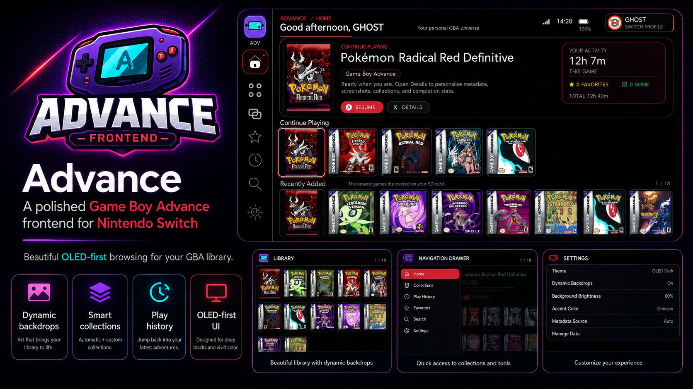

# Advance



**Advance** is a native Nintendo Switch homebrew frontend that turns an existing mGBA ROM collection into a polished, personal Game Boy Advance library experience.

Advance does **not** emulate games itself and does not include ROMs, copyrighted game artwork, or downloads. It launches the user's existing mGBA installation and works with locally owned ROM dumps and artwork.

> **Public alpha:** v0.4 is the current development line. The project is already usable on real Switch hardware, and this build continues the store-readiness push with higher-quality branded navigation and more polished UI assets.

## v0.4 — Definitive polish pass

Advance v0.4 is a hardware-focused refinement pass aimed at making the frontend feel less like homebrew UI and more like a finished console product:

- real packaged **Lucide-based navigation icons** for Home, Library, Collections, Favorites, Recent, Search, and Settings
- a cleaner dedicated **sidebar mark** derived from the Advance store identity instead of a hand-drawn placeholder
- sidebar, drawer, Settings preview, boot screen, About screen, and missing-art states now reuse the same real brand assets
- wider, clearer expanded navigation with stronger focus hierarchy
- larger top-level typography and cleaner header/subtitle glass treatment
- improved controller footer with grouped command pills and an unobtrusive alpha-version marker
- more cinematic diagonal section transitions
- selected covers now use artwork-filled atmospheric backgrounds behind the uncropped full box art, eliminating harsh black letterboxing
- refined selected-cover bloom and focus pulse
- redesigned Library selected-game panel with a real cover thumbnail, stronger title hierarchy, metadata state chips, paging, and Play/Resume action
- improved Home activity card so Favorite/Completed counts no longer truncate
- better empty Collection cards instead of large blank panels
- less developer-centric Settings copy and a cleaner library-status panel
- stronger ROM-hack title heuristics that reject archive/product-code labels such as `A-BPEE e` and prefer the ROM header or descriptive metadata
- matching title-detection improvements in `library-doctor.py`
- runtime branding/icon assets are installed automatically to the SD card

## Navigation drawer

The left rail stays compact while browsing and expands into a full overlay drawer when focused. Home, Library, Collections, Favorites, Recent, Search, and Settings remain available without shifting the underlying layout.

- Left from the left-most content item opens the drawer
- Up/Down changes destination
- A opens
- B or Right collapses
- touch supports tap-to-expand and tap-to-open

## Home

- dynamic game-art backdrop
- personalized time-aware greeting and Switch profile
- Spotlight hero
- Continue Playing
- Recently Added
- Favorites
- Most Played
- smart Pokémon / ROM Hack / Completed shelves when applicable
- Surprise Me random discovery
- tracked launches, last played, favorites, completion state, and approximate play time

## Library

- recursive ROM scanning
- 4–7 columns and 2–3 rows
- Favorites / Recently Played / Search / collection shelves
- sorting by A–Z, recent, launches, play time, recently added, or favorites
- game-adaptive selection accents
- branded missing-art fallback
- NEW badges for newly indexed unplayed games

## Details

- cover art
- title source
- author / version / base game / genre / year metadata
- description
- play time, launch count, last played
- screenshots
- favorite, completed, hidden state
- custom display title
- custom collection membership

## Personalization

- real Switch profile nickname and avatar when Horizon exposes them
- local `profile.png` / `profile.txt` fallback
- seven OLED themes: Aurora Violet, Crimson, Atomic Purple, Emerald, Midnight Gold, Ice Blue, Neon Coral
- adaptive selected-game accents
- dynamic backdrops and intensity control
- screen and launch transitions
- touch input
- synthesized UI sounds and volume control
- system clock, Wi-Fi, battery, and charging state

## Expected SD layout

Advance defaults to the layout this project was built around:

```text
SD:/
├── mGBA/
│   └── Roms/
│       ├── Pokemon Radical Red/
│       │   ├── A-3244 e.gba
│       │   ├── cover.png
│       │   ├── banner.jpg              # optional
│       │   ├── screenshot1.png         # optional
│       │   └── advance.json            # optional but recommended
│       └── ...
│
└── switch/
    ├── mgba.nro
    └── advance/
        ├── advance.nro
        ├── config.ini
        ├── state.tsv
        ├── titles.tsv
        ├── collections.tsv
        ├── assets/
        │   ├── store-icon.png
        │   ├── advance-logo.png
        │   ├── sidebar-brand.png
        │   ├── sidebar-mark.png
        │   └── icons/                  # packaged navigation icon assets
        ├── session.pending             # temporary play-time reconciliation state
        └── diagnostics.log
```

Your numbered ROM filenames can remain exactly as they are. Advance never renames or modifies them.

## Name resolution

Advance 0.4 resolves display titles in this order:

1. manual title override from `titles.tsv`
2. `advance.json` title
3. legacy `title.txt`, `name.txt`, or sidecar metadata
4. the best descriptive game-folder / cover-art filename candidate
5. internal cartridge title
6. raw filename only as a final fallback

For ROM-hack collections, **`advance.json` is the definitive metadata source**.

## `advance.json`

Put `advance.json` next to the ROM. Example:

```json
{
  "title": "Pokemon Radical Red Definitive",
  "short_title": "Radical Red",
  "author": "ROM Hack Author",
  "version": "4.1",
  "base_game": "Pokemon FireRed",
  "genre": ["RPG", "ROM Hack"],
  "tags": ["Pokemon", "Difficulty", "Modern mechanics"],
  "description": "A challenging enhancement hack with modern mechanics and expanded encounters.",
  "release_year": 2026,
  "cover": "cover.png",
  "banner": "banner.jpg",
  "screenshots": ["screenshot1.png", "screenshot2.png"]
}
```

See `examples/advance.json`.

## Controls

### Global drawer
- Left from the left-most item — open navigation drawer
- Up / Down — choose destination
- `A` — open destination
- `B` or Right — close drawer
- Touch — tap rail to expand; tap destination to open

### Home
- D-pad / left stick — browse games and shelves
- `A` — play
- `X` — details
- `Y` — favorite
- `R` — Surprise Me
- `L` — library
- `-` — search
- `+` — settings
- `B` — exit

### Library
- D-pad / left stick — browse
- `A` — play
- `X` — details
- `Y` — cycle sort mode
- `L` — Favorites
- `R` — Recently Played
- `ZL` / `ZR` — page
- `-` — search
- `B` — Home

### Details
- `A` — play
- `Y` — favorite
- `X` — edit display title
- `R` — custom collections
- `ZR` — mark completed
- `ZL` — hide/unhide
- `-` — restore automatic title
- `B` — back

## Building

### Docker — recommended

```bash
chmod +x scripts/*.sh tools/*.py
./scripts/build-docker.sh
```

Output:

```text
advance.nro
```

The Docker build script hands generated artifacts back to the host UID/GID so build folders are not left root-owned.

### Local devkitPro

```bash
./scripts/build-local.sh
```

Requires devkitPro / devkitA64, libnx, SDL2, SDL2_image, and SDL2_ttf.

## Install / upgrade

Fresh install:

```bash
./scripts/install-to-sd.sh /path/to/mounted/sd
```

Upgrade an existing Advance install:

```bash
./scripts/upgrade-existing-sd.sh /path/to/mounted/sd
```

The upgrade script preserves mGBA, ROMs, artwork, `config.ini`, favorites/history, title overrides, and collections.

## Desktop library tools

### Full doctor

```bash
python3 tools/library-doctor.py "/path/to/mGBA/Roms"
```

JSON report:

```bash
python3 tools/library-doctor.py "/path/to/mGBA/Roms" \
  --json-report ~/Downloads/advance-library-report.json
```

Create `advance.json` stubs only where metadata is missing:

```bash
python3 tools/library-doctor.py "/path/to/mGBA/Roms" \
  --write-missing-metadata
```

The doctor reports missing art, weak titles, invalid metadata, missing referenced files, archive-ID folders, and possible duplicate ROM payloads. It never renames ROMs.

### Interactive metadata wizard

```bash
python3 tools/metadata-wizard.py "/path/to/mGBA/Roms/Pokemon Radical Red"
```

### Existing artwork sync

`cover-sync.py` can fuzzy-match locally owned artwork. It never downloads anything.

## Play-time note

Advance hands execution to mGBA. Before launch it stores a tiny pending-session marker; when Advance is opened again it reconciles the elapsed time, capped at 12 hours. This provides useful library history without modifying mGBA, but it is intentionally described as **approximate play time** rather than frame-perfect telemetry.

## Public release posture

The repository includes:

- reproducible Docker build
- GitHub Actions build workflow
- Homebrew App Store preparation notes
- release checklist
- changelog
- MIT license
- no ROM/art downloads
- no bundled copyrighted box art
- safe migration from 2.x state/config formats

Before a public Homebrew App Store submission, test on real hardware in both full-memory title-override mode and any applet mode you intend to support.

## Third-party assets

Advance uses navigation glyphs based on [Lucide Icons](https://lucide.dev/), released under the ISC License. The bundled attribution/license text is in `assets/icons/LICENSE-LUCIDE.txt`.

## License

MIT. See `LICENSE`.